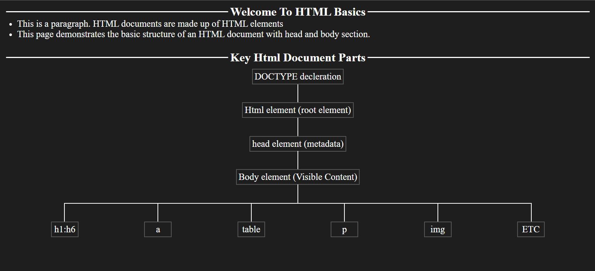

# Visual Arrangement Project

An interactive frontend layout animation demo using pure HTML, CSS, and JavaScript.

## Features

- DOM manipulation and animation using vanilla JS
- Smooth transition between UI states
- Simulates layout reordering with user interaction

## Preview

[Live Demo](https://Nischalplays.github.io/Visual-arrangement-project/)

## How to Use

Just open `index.html` in a browser or view the [live demo](#preview).

## Screenshot

## License

MIT
